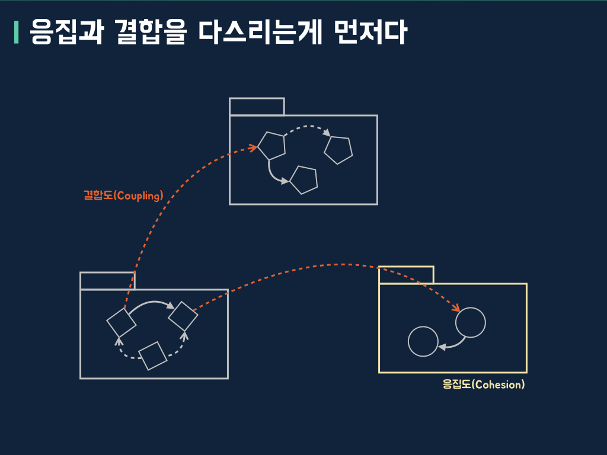
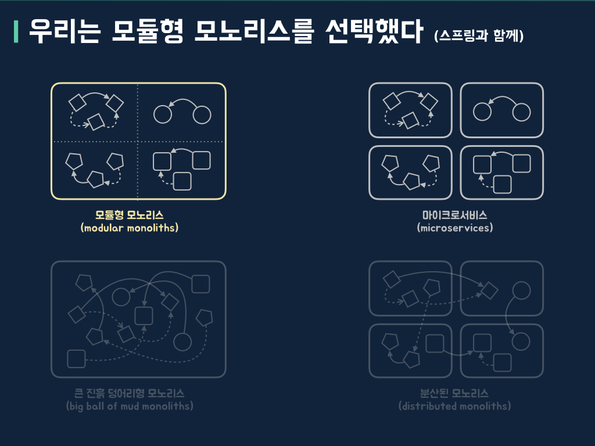
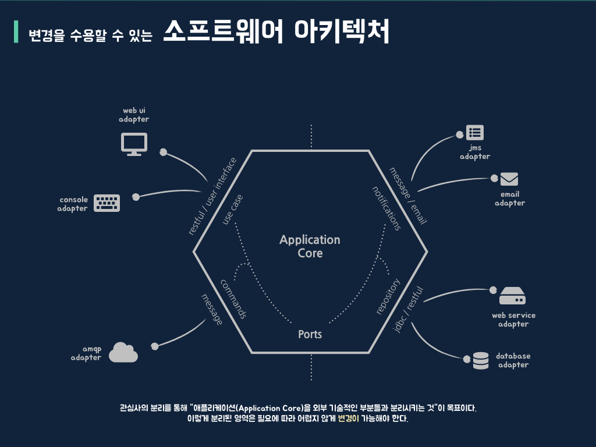

# Building modular monoliths using spring

마이크로서비스 스타일로 만들어진 시스템을 모노리틱 스타일로 이관한 사례와 함께 스프링을 이용해 모듈형 모노리스(modular monoliths)를 만든 경험을 바탕으로 모노리틱/마이크로서비스 보다 본질적인 문제를 제기하고, 문제 해결을 위한 아이디어와 코드를 공유합니다. [슬라이드(slide)](https://www.slideshare.net/arawnkr/ss-195979955)는 외부에 공개되어 있습니다.

## 문제

마이크로서비스 아키텍처 스타일은 공짜도 은총알도 아니지만, 과장된 광고로 어디에나 사용할 수 있는 황금 망치로 오인되고 있다. 마이크로서비스로 올바르게 시스템을 구축하기 위해서는 분산 시스템이 가진 복잡성을 해결해야 하며, 무엇보다 개별 마이크로서비스가 독립성을 가지고 성장할 수 있는 아키텍처와 설계가 뒷받침 되어야 한다. 이때 필요한 설계 원칙 중 가장 중요한 요소는 높은 응집도(Cohesion)와 느슨한 결합도(Coupling)라 생각한다. 이 요소는 잘 구조화된 모노리틱 스타일 시스템을 만들 때도 동일하게 필요하다.

아키텍처 스타일은 소프트웨어가 가진 복잡성을 다루기 위해 만들어졌고, 소프트웨어 설계 시 다뤄야 하는 여러가지 원칙을 함께 갖추고 있다. 하지만 그 겉모습만 쫓아다니는 경우를 많이 보았다. 그래서 나는 응집과 결합을 다스리는 것이 아키텍처 스타일보다 먼저라고 말하고 싶다.

## 모듈형 모노리스(modular monoliths) 

[시몬 브라운(Simon Brown)](https://simonbrown.je)은 모듈화로 훌륭한 모노리틱 스타일 시스템을 만들 수 있으며, 그것을 [모듈형 모노리스(Modular Monoliths)](https://youtu.be/5OjqD-ow8GE)라 부르고 소개했다. 

우리는 담당하고 있던 시스템이 마이크로서비스가 주는 혜택을 누리지 못하고, 오히려 개발과 운영에 있어 오버헤드(overhead)가 과하게 발생하고 있다고 판단했다. 그래서 모노리틱 스타일로 아키텍처를 재구성했으며, 재구성 과정에서 모듈화를 시도했다. 쉽지 않은 도전이었지만 덕분에 불안정했던 시스템 개발과 운영을 안정화할 수 있었다.

## 모듈화와 소프트웨어 아키텍처

로버트 C. 마틴(Robert C. Martin)의 저서 [클린 아키텍처](https://blog.insightbook.co.kr/2019/08/08/클린-아키텍처/)에서 발췌한 내용이다.

> 좋은 아키텍처는 시스템이 모노리틱 구조로 태어나서 단일 파일로 배포되더라도, 이후에는 독립적으로 배포 가능한 단위들의 집합으로 성장하고, 또 독립적인 서비스나 마이크로서비스 수준까지 성장할 수 있도록 만들어져야 한다. 또한 좋은 아키텍처라면 나중에 상황이 바뀌었을 때 이 진행 방향을 거꾸로 돌려 원래 형태인 모노리틱 구조로 되돌릴 수도 있어야 한다. 

시스템은 다양한 외부요소로 지속해서 영향받아 변할 수밖에 없다. 시스템 구조를 바꾸는 것이 쉬운 건 아니지만, 환경에 적응할 수 있는 시스템을 개발해야 한다. 나는 이게 가능해지려면 모듈화와 소프트웨어 아키텍처를 잘 다뤄야 한다고 생각한다.

    

        
        
    

## 예제 코드

나에게 가장 익숙한 이커머스(e-commerce) 도메인을 단순하게 정의하고, 모듈형 모노리스 예제로 만들었다.

핵심 도메인으로 상품(catalogs), 주문(orders), 배송(shipments)을 추출 후 4단계에 걸쳐 코드를 작성했다.  

* step_1: modularization - 도메인 중심 모듈화와 모듈간 의존성 관리
* step_2: encapsulation and separately - 모듈을 보호하고, 모듈간 의존성 분리 
* step_3: context boundaries - 모듈 독립성을 돕는 컨텍스트 경계
* step_4: modularizing configurations  - 컨텍스트 환경 모듈화

조만간 컨텍스트를 별도 서비스로 분리, 마이크로서비스 아키텍처 스타일로 확장하는 단계를 추가할 예정이다.

## 마무리

> software maintenance is not 'keep it working like before' 
> It is 'keep it being useful in a changing world'
>
> Jessica Keer, Atomist

 우리가 시스템(소프트웨어)을 만들고, 성장시키며, 관리하는 이유는 시스템 사용자가 가진 문제를 해결해주고, 사용자에게 가치를 주기 위해서이다. 우리는 문제를 해결하기 위해 도구를 선택하는 것과 도구가 문제를 해결해줄 것이라고 선택하는 사이에서 무엇이 중요한지 생각해볼 필요가 있다.